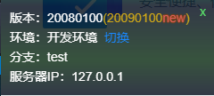

# whistle.version-info 插件
## 作用
- 显示当前**版本号**、**环境信息**、**版本分支**、**服务器IP**信息
- 判断当前是不是所在分支最新环境
- 使用后，效果如下

    

## 使用准备
> 测试，产品使用关注1-3即可，开发使用关注1-6

1. 安装`whistle`, [安装指南](http://wproxy.org/whistle/install.html)
2. `whistle.version-info`插件
    ```node
    npm i -g whistle.version-info
    ```
3. 使用插件
    ```rules
    pattern whistle.version-info://服务器IP
    # 或
    pattern whistle.version-info://
    ```
4. 插件配置
    ```js
    host地址 - 获取远程版本信息地址
    环境列表  - 根据ip匹配显示环境名
    ```
5. 项目版本hook配置
    ```js
    ver-hook run <version.json-path> [callback-script-file]
    ```    
6. 远程版本存放地址（自行解决）
 - 注意事项：`完整地址 = host地址 + 版本分支 + version.json`
7. version.json解析
- 版本hook自动生成
    ```js
    {
        "version": "20080100",       // 版本号
        "branch": "dev",             // 版本分支
        "cos": "http://xxx.xxx.com", // 远程版本信息host(可选，手动填写，优先级高于插件)
        "envMap": {                  // 环境列表(可选，手动填写，优先级高于插件)
            "127.0.0.1": "开发环境"
        }
    }
    ```
